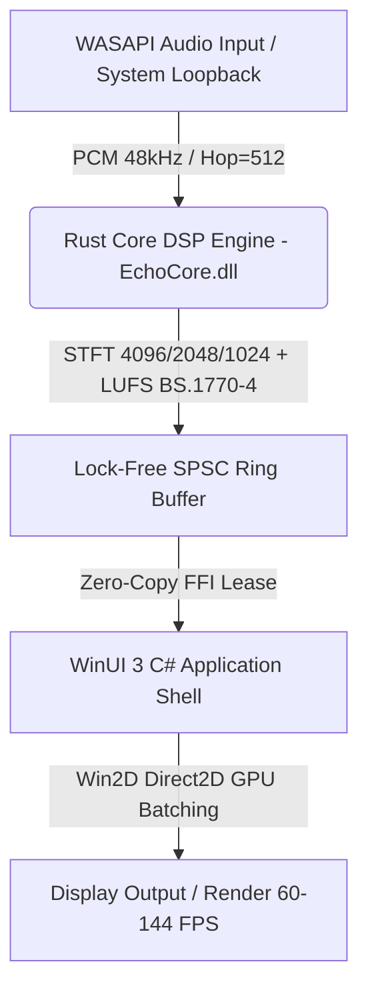

<div align="center">

  

  # Echo Visualizer

  **Ultra-Low Latency, High-Fidelity Real-Time Audio Visualizer for Windows**

  [](https://github.com/)
  [](https://microsoft.com)
  [](https://learn.microsoft.com/windows/apps/winui/winui3/)
  [](https://www.rust-lang.org/)
  [](https://github.com/microsoft/Win2D)
  [](LICENSE)

</div>

---

## Overview

**Echo Visualizer** is a native Windows desktop application (supporting x64 and ARM64) engineered to capture high-fidelity real-time system audio (*WASAPI System Loopback* / Microphone Inputs) and render fluid, flicker-free audio spectrum visualizers via hardware-accelerated Direct2D GPU rendering (Win2D).

It bridges a high-performance **Rust DSP Engine** (low-level floating-point processing, multiresolution STFT, ITU-R BS.1770-4 LUFS psychoacoustic calibration) with a modern, responsive user interface built on **WinUI 3 (Windows App SDK)**.

---

## 📦 Distribution Channels & Installation

### 1. GitHub Releases (Standalone / Unpackaged) — Recommended for Portability
Direct download requiring no formal installation or administrator privileges:
1. Navigate to the [Releases](https://github.com/) section of the repository.
2. Download the appropriate `.zip` package for your processor architecture:
   - `EchoVisualizer-A.B.C.D-win-x64.zip` (Intel/AMD 64-bit systems)
   - `EchoVisualizer-A.B.C.D-win-arm64.zip` (ARM64 systems / Surface Pro / Copilot+ PCs)
3. Extract the archive into any local directory and run `EchoVisualizer.exe`.

> **Note on Windows SmartScreen / Code Signing**: Unpackaged standalone builds distributed via GitHub Releases may prompt a Windows SmartScreen warning ("Unknown Publisher") if a commercial certificate is not attached. Click *More info -> Run anyway*. For an unprompted installation experience, use the official Microsoft Store package.

### 2. Microsoft Store (MSIX / Packaged)
Recommended channel for secure automatic updates and seamless Store integration. *(Coming soon to the Microsoft Store)*.

---

## ✨ Key Features

| Feature | Description |
| :--- | :--- |
| **WASAPI Loopback Capture** | Continuous zero-latency capture of global system audio output or any active input audio device. |
| **Rust Core DSP Engine** | 12 to 128 band spectral analysis via multiresolution STFT (Blackman-Harris windowing) with compute latency $L_c < 1.5\text{ ms}$ (p99). |
| **Win2D GPU Batching** | Immediate-mode Direct2D primitives rendered on the GPU at 60–144+ FPS without XAML framework overhead. |
| **Spectral Bar Equalizer** | Continuous log-frequency band mappings, asymmetric inertial smoothing (instant attack / exponential decay), and layout modes (*Bottom-Up*, *Top-Down*, *Center-Out/Mirror*). |
| **Chromatic Personalization** | *Audio Mapped* mode (reactive dynamic hue based on spectral centroid) and *Custom Palette* modes (Primary/Secondary R/G/B). |
| **Smart Overlay** | Floating UI controls with automatic cursor auto-hide after 4 seconds of inactivity. |

---

## 🏗️ Architecture



---

## 🛠️ Development Setup & Local Building

### Prerequisites
- **Operating System:** Windows 10 (1809+) or Windows 11 (x64 / ARM64).
- **IDE / SDK:** Visual Studio 2022 / 2026 with *.NET Desktop Development*, MSVC x64/x86 build tools, and MSVC ARM64 build tools for cross-compilation.
- **Runtime:** .NET 8 SDK (`net8.0-windows10.0.26100.0`).
- **Rust Toolchain:** Rust stable (`x86_64-pc-windows-msvc` or `aarch64-pc-windows-msvc`).

### CLI Build Commands

The repository provides a single validated distribution entrypoint. The
following command runs the quality gates, builds both distribution profiles for
x64 and ARM64, and performs structural artifact validation:

```powershell
.\scripts\Build-Distributions.ps1 -Profile Both
```

To build, sign, install, and smoke-test a local x64 MSIX with a temporary
package version while also smoke-testing the unpackaged executable:

```powershell
.\scripts\Build-Distributions.ps1 `
  -Profile Both `
  -RuntimeIdentifiers win-x64,win-arm64 `
  -PackageVersion 0.2.0.18 `
  -SignMsix `
  -InstallMsix `
  -SmokeTest
```

#### Run Unit & FFI Tests
```powershell
# Rust Core DSP unit tests
cargo test --manifest-path src/core/Cargo.toml

# C# UI & FFI unit tests
dotnet test tests/EchoVisualizer.Tests/EchoVisualizer.Tests.csproj -c Release -p:Platform=x64
```

#### Build Standalone Unpackaged GitHub Distributions
```powershell
.\scripts\Build-Distributions.ps1 `
  -Profile GitHub `
  -RuntimeIdentifiers win-x64,win-arm64 `
  -SkipTests
```

Outputs are written to `artifacts/github/win-x64/` and
`artifacts/github/win-arm64/`.

#### Build Microsoft Store MSIX Packages
```powershell
.\scripts\Build-Distributions.ps1 `
  -Profile Store `
  -RuntimeIdentifiers win-x64,win-arm64 `
  -SkipTests
```

Outputs are written below `artifacts/store-test/`. Use `-PackageVersion` only
for an isolated local test identity; it does not modify the official version in
the repository.

#### Validate Product Metadata and Branding

```powershell
.\scripts\Test-ProductConfiguration.ps1
.\scripts\Generate-BrandAssets.ps1 -Check
```

`build/Product.props` is the canonical official version and product identity.
The package manifest, Rust package, README badge, and changelog are validated
projections. Brand assets are deterministically generated from
`docs/public/Echo-Logo-Large.png` and `build/branding.json`; regenerate them
with `Generate-BrandAssets.ps1` after an intentional source or recipe change.

### Microphone Privacy and Theme Behavior

- The MSIX declares the Windows `microphone` capability. The unpackaged desktop
  build uses the global **Let desktop apps access your microphone** Windows
  privacy control and therefore may not display a separate per-app consent
  prompt.
- When direct capture is denied or produces no data, Echo reports the selection
  status and links to the applicable Windows microphone privacy page.
- The default **System** theme follows the Windows application theme at startup
  and when it changes while Echo is running. Explicit Light and Dark choices
  remain fixed.

---

## 📁 Repository Structure

```text
Echos-Live-Music-Visualizer/
├── .github/
│   ├── dependabot.yml         # Monthly dependency update configuration
│   └── workflows/
│       ├── ci.yml             # Automated CI Quality Gate workflow
│       ├── release.yml        # Official tag-triggered GitHub Release CD workflow
│       └── store-build.yml    # Manual Microsoft Store MSIX packaging workflow
├── build/                     # Canonical product metadata and branding recipe
├── scripts/                   # Shared local/CI build and validation entrypoints
├── src/
│   ├── core/                  # Audio DSP engine in Rust (EchoCore.dll)
│   └── ui/                    # WinUI 3 C# application shell, Win2D renderers, and Views
├── tests/
│   └── EchoVisualizer.Tests/  # C# unit, integration, and FFI stress tests
├── docs/
│   └── public/                # Specifications, traceability reports, and assets
├── CONTRIBUTING.md            # Contribution guidelines and hygiene rules
├── SECURITY.md                # Security policy and disclosure process
├── CHANGELOG.md               # Version release notes and changelog
└── LICENSE                    # MIT License
```

---

## 📄 License

Distributed under the **MIT License**. See [`LICENSE`](LICENSE) for details.
