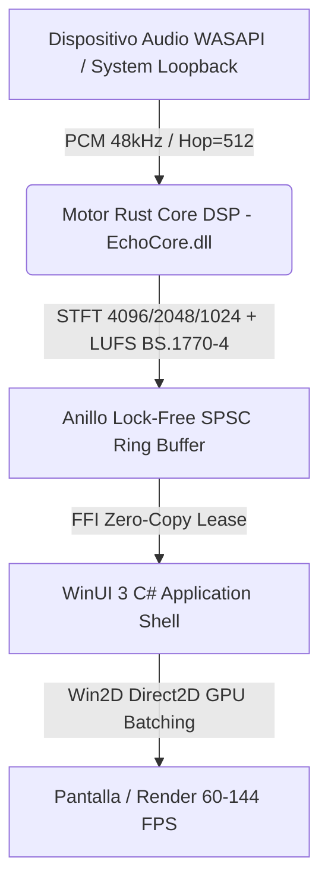

<div align="center">

  

  # Echo Visualizer

  **Visualizador de Audio en Tiempo Real de Ultra-Bajo Consumo y Alta Fidelidad para Windows**

  [](https://github.com/)
  [](https://microsoft.com)
  [](https://learn.microsoft.com/windows/apps/winui/winui3/)
  [](https://www.rust-lang.org/)
  [](https://github.com/microsoft/Win2D)
  [](LICENSE)

</div>

---

## Descripción General

**Echo Visualizer** es una aplicación de escritorio nativa para Windows (x64 y ARM64) diseñada para capturar audio de alta fidelidad en tiempo real (*WASAPI System Loopback* / Entradas de Micrófono) y renderizar espectros sonoros reactivos mediante aceleración por hardware GPU (Win2D Direct2D).

Combina un motor **DSP escrito en Rust** (procesamiento en coma flotante de bajo nivel, STFT multirresolución, calibración psicoacústica LUFS ITU-R BS.1770-4) con una interfaz de usuario fluida y moderna basada en **WinUI 3 (Windows App SDK)**.

---

## 📦 Canales de Distribución e Instalación

### 1. GitHub Releases (Standalone / Unpackaged) — Recomendado para portabilidad
Descarga directa sin necesidad de instalación formal ni permisos de administrador:
1. Dirígete a la sección de [Releases](https://github.com/) del repositorio.
2. Descarga el paquete `.zip` correspondiente a tu arquitectura:
   - `EchoVisualizer-vX.Y.Z-win-x64.zip` (Equipos Intel/AMD)
   - `EchoVisualizer-vX.Y.Z-win-arm64.zip` (Equipos ARM64 / Surface Pro / Copilot+ PCs)
3. Descomprime el archivo en cualquier carpeta local y ejecuta `EchoVisualizer.exe`.

> **Nota sobre SmartScreen / Firma Digital**: Las builds gratuitas distribuidas a través de GitHub Releases pueden mostrar un aviso de Windows SmartScreen ("Editor desconocido") si aún no se ha asociado un certificado comercial. Puedes hacer clic en *Más información -> Ejecutar de todos modos*. Para una experiencia sin advertencias, utiliza la versión oficial de Microsoft Store.

### 2. Microsoft Store (MSIX / Packaged)
Canal recomendado para actualizaciones automáticas seguras e integración nativa de Windows Store. *(Próximamente disponible en Microsoft Store)*.

---

## ✨ Características Principales

| Característica | Descripción |
| :--- | :--- |
| **Captura WASAPI Loopback** | Captura continua del audio global del sistema operativo o cualquier dispositivo de entrada sin latencia apreciable. |
| **Motor DSP en Rust** | Análisis espectral de 12 a 128 bandas mediante STFT multirresolución (Blackman-Harris) con consumo de cómputo $L_c < 1.5\text{ ms}$ (p99). |
| **Renderizado Win2D GPU Batching** | Dibujo en modo inmediato procesado directamente por la GPU a 60--144+ FPS sin sobrecostos de interfaz XAML. |
| **Ecualizador de Barras Espectral** | Mapeos continuos por frecuencia, suavizado inercial asimétrico (ataque instantáneo / caída exponencial) y modos de disposición (*Bottom-Up*, *Top-Down*, *Center-Out/Espejo*). |
| **Personalización Cromática** | Modos *Mapeado por Audio* (matiz dinámico reactivo al centroide tímbrico) y *Paleta Personalizada* (Primary/Secondary R/G/B). |
| **Overlay Inteligente** | Controles flotantes con auto-ocultamiento automático a los 4 segundos de inactividad del cursor. |

---

## 🏗️ Arquitectura del Sistema



---

## 🛠️ Requisitos de Desarrollo y Compilación Local

### Requisitos Previos
- **Sistema Operativo:** Windows 10 (1809+) o Windows 11 (x64 / ARM64).
- **Entorno IDE / SDK:** Visual Studio 2022 / 2026 con la carga de escritorio `.NET`.
- **Runtime:** .NET 8 SDK (`net8.0-windows10.0.26100.0`).
- **Toolchain de Rust:** Rust estable (`x86_64-pc-windows-msvc` o `aarch64-pc-windows-msvc`).

### Comandos de Compilación por Perfil

#### Compilar e Inspeccionar Pruebas Unitarias
```powershell
# Pruebas unitarias del Motor Rust Core
cargo test --manifest-path src/core/Cargo.toml

# Pruebas unitarias de C# UI / FFI
dotnet test tests/EchoVisualizer.Tests/EchoVisualizer.Tests.csproj -c Release -p:Platform=x64
```

#### 1. Publicación Unpackaged para GitHub Releases (x64)
```powershell
dotnet publish src/ui/EchoVisualizer.csproj -c Release -r win-x64 -p:BuildingForGitHub=true
# El output self-contained se generará en: artifacts/github/win-x64/
```

#### 2. Publicación Unpackaged para GitHub Releases (ARM64)
```powershell
dotnet publish src/ui/EchoVisualizer.csproj -c Release -r win-arm64 -p:BuildingForGitHub=true
# El output self-contained se generará en: artifacts/github/win-arm64/
```

#### 3. Empaquetado MSIX para Microsoft Store (x64)
```powershell
dotnet publish src/ui/EchoVisualizer.csproj -c Release -r win-x64 -p:BuildingForStore=true -p:Platform=x64
# El paquete MSIX se generará en: artifacts/store/
```

---

## 📁 Estructura del Repositorio

```text
Echos-Live-Music-Visualizer/
├── .github/
│   ├── dependabot.yml         # Configuración de actualizaciones de dependencias
│   └── workflows/
│       ├── ci.yml             # Quality gate automatizado (CI)
│       ├── release.yml        # Workflow oficial de release GitHub Releases (CD)
│       └── store-build.yml    # Build manual de empaquetado Store MSIX
├── src/
│   ├── core/                  # Motor DSP de procesamiento de audio en Rust (EchoCore.dll)
│   └── ui/                    # Shell de interfaz WinUI 3 C#, renderizador Win2D y Vistas
├── tests/
│   └── EchoVisualizer.Tests/  # Suite de pruebas unitarias C# / FFI e integración
├── docs/
│   └── public/                # Especificaciones, trazabilidad e isotipos del proyecto
├── CONTRIBUTING.md            # Guía de contribución y buenas prácticas
├── SECURITY.md                # Política de reporte de vulnerabilidades
└── LICENSE                    # Licencia MIT del proyecto
```

---

## 📄 Licencia

Este proyecto se publica bajo la Licencia **MIT**. Consulta el archivo [`LICENSE`](LICENSE) para más detalles.
